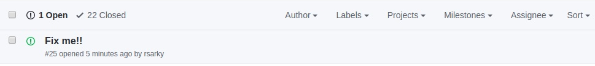
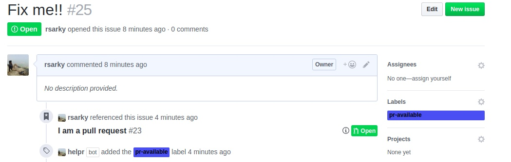

<div align="center">
<h2>helPR</h2>
</div>

A GitHub App built with [Probot](https://github.com/probot/probot) that assigns labels to issues based on the status of the PR associated with it.

## Usage

Using helpr is pretty straightforward. Just [install](https://github.com/apps/helpr) the app on your repository and you are ready to go. :100: 


Consider this open issue :


<br><br>

Now when someone references this issue in a pull request helpr will automatically add the label `pr-available` :


<br><br>


**helpr** supports 3 labels :
* `pr-available`
* `pr-merged`
* `pr-rejected`

When a PR for an issue is merged or rejected **helpr** will remove the `pr-available` label and add the respective merged or rejected label.


## Setup

```sh
# Install dependencies
npm install

# Run the bot
npm start
```

See [docs/deploy.md](docs/deploy.md) if you would like to run your own instance of this app.
